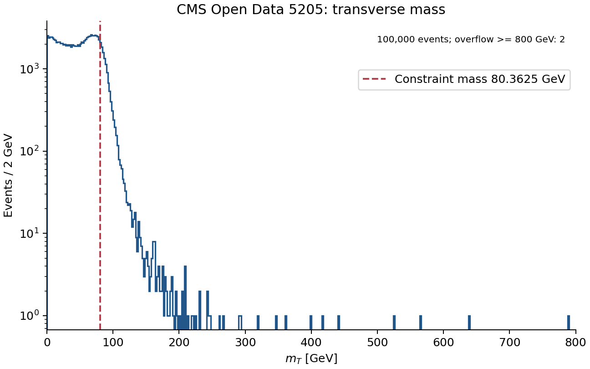
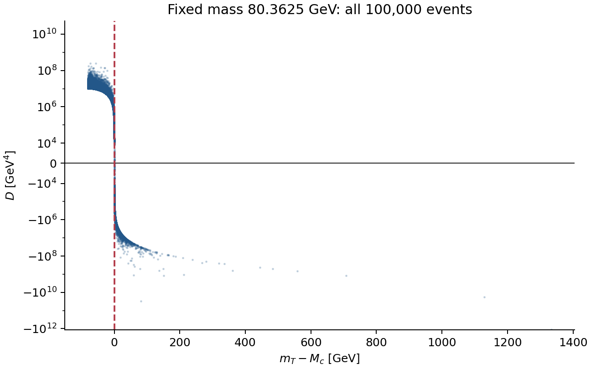

# W→μν Invisible-State Reconstruction

**Exact longitudinal neutrino-momentum reconstruction from CMS Open Data, with an analytical classification of the two-real-root, tangent, and no-real-root regimes.**

This repository studies a standard but fundamental reconstruction problem in hadron-collider physics:

$$
W \rightarrow \mu \nu .
$$

The measured event contains a reconstructed muon and missing transverse momentum, but the neutrino longitudinal momentum $p_z^\nu$ is not directly observed. The aim is to determine exactly what can — and cannot — be reconstructed from the published event information once a fixed parent-mass constraint is imposed.

The central result is an exact factorization of the quadratic discriminant in terms of the transverse mass:

$$
\boxed{
D=
\frac14
\left(M_c^2-m_T^2\right)
\left[
M_c^2-m_T^2+4E_{T\mu}p_T^\nu
\right]
}
$$

which gives the complete real-solution classification:

$$
\boxed{m_T\lt M_c \Rightarrow 2\ \text{real solutions}}
$$

$$
\boxed{m_T=M_c \Rightarrow 1\ \text{repeated/tangent solution}}
$$

$$
\boxed{m_T>M_c \Rightarrow 0\ \text{real solutions}}
$$

This result also fixes an important interpretation point: a negative discriminant does **not** by itself mean that the recorded event is physically impossible. It means that, for the measured transverse quantities and the chosen fixed mass $M_c$, there is no real value of $p_z^\nu$ satisfying that exact mass-shell constraint.

## Repository guide

[Scientific scope](#section-1) · [Fixed mass](#section-3) · [Quadratic solution](#section-4) ·
[Factorization](#section-6) · [Branch classification](#section-7) ·
[Reproduction specification](#section-10) · [Limitations](#section-14) ·
[Provenance](#section-15) · [Verified results](#verified-results)

For installation and executable commands, see [REPRODUCING.md](REPRODUCING.md).
Source acquisition is specified in [data/README.md](data/README.md).
This is an independent project; it is not an official CMS or CERN project.

---

<a id="section-1"></a>

## 1. Scope

The study uses the complete 100,000-event educational CMS Open Data sample:

**W to muon and neutrino 2011 — CERN Open Data Portal, record CMS-5205**

https://opendata.cern.ch/record/5205

The data were recorded by CMS in 2011 and published through the CERN Open Data Portal. They are derived from the Run2011A `SingleMu` primary dataset.

The CERN record explicitly states that this sample was prepared for education and outreach, contains only a subset of the full event information, and is **not suitable for a full precision physics analysis**. This repository respects that limitation. The purpose here is not to measure the $W$-boson mass or produce a CMS physics result; it is to study the exact kinematic reconstruction problem supported by the published observables.

### Event selection used in the source dataset

The CERN Open Data record specifies:

- exactly one global muon with

  $$
  p_T^\mu>25\ \text{GeV},\qquad |\eta_\mu|<2.1;
  $$
- rejection of events containing a second global muon with

  $$
  p_T>10\ \text{GeV},\qquad |\eta|<2.4.
  $$

### Published event variables

The source file contains:

- `Run`
- `Event`
- `pt`
- `eta`
- `phi`
- `Q`
- `chiSq`
- `dxy`
- `iso`
- `MET`
- `phiMET`

The crucial limitation is equally important: the neutrino longitudinal momentum $p_z^\nu$ is **not** among the published observables.

### Frozen input fingerprint used for this study

The local source file used in the reconstruction was:

```text
Wmunu.csv
events:    100000
size:      7969331 bytes
Adler-32:  0607d5ee
```

The file fingerprint is included so that later reproductions can verify that they are operating on the same input artifact.

---

<a id="section-2"></a>

## 2. The reconstruction problem

For every event, the published information determines the muon transverse momentum and direction,

$$
p_T^\mu,\qquad \eta_\mu,\qquad \phi_\mu,
$$

and the missing transverse momentum,

$$
\vec p_T^{\,\mathrm{miss}}.
$$

For the reconstruction considered here, the missing transverse momentum is identified with the neutrino transverse momentum:

$$
\vec p_T^\nu=\vec p_T^{\,\mathrm{miss}},
\qquad
p_T^\nu=\mathrm{MET},
\qquad
\phi_\nu=\phi_{\mathrm{MET}}.
$$

The transverse neutrino components are therefore fixed:

$$
p_x^\nu=p_T^\nu\cos\phi_\nu,
$$

$$
p_y^\nu=p_T^\nu\sin\phi_\nu.
$$

For the muon,

$$
p_x^\mu=p_T^\mu\cos\phi_\mu,
$$

$$
p_y^\mu=p_T^\mu\sin\phi_\mu,
$$

$$
p_z^\mu=p_T^\mu\sinh\eta_\mu.
$$

Using the muon mass $m_\mu$,

$$
E_\mu=
\sqrt{
m_\mu^2+
(p_T^\mu)^2+
(p_z^\mu)^2
},
$$

and

$$
E_{T\mu}=
\sqrt{
m_\mu^2+(p_T^\mu)^2
}.
$$

For a massless neutrino,

$$
E_\nu=
\sqrt{
(p_T^\nu)^2+(p_z^\nu)^2
}.
$$

Before any parent-mass condition is imposed, the published transverse event information does not determine a unique $p_z^\nu$. Any real longitudinal value is kinematically available at this stage:

$$
p_z^\nu\in\mathbb R.
$$

A further physical condition is therefore required.

---

<a id="section-3"></a>

## 3. Fixed-$W$-mass constraint

Impose the mass-shell condition

$$
(p_\mu+p_\nu)^2=M_c^2,
$$

where $M_c$ is the selected $W$-mass value used for reconstruction.

The primary value used in the frozen analysis is

$$
\boxed{
M_c = 80.3625\ \text{GeV}
}
$$

corresponding to the 2026 PDG world-average value

$$
M_W=80.3625\pm0.0077\ \text{GeV}.
$$

The historical value

$$
M_c=80.4\ \text{GeV}
$$

is retained as a sensitivity/control value rather than silently mixing mass conventions.

This repository does **not** estimate $M_W$. The mass is an external reconstruction input.

---

<a id="section-4"></a>

## 4. Exact quadratic solution for $p_z^\nu$

Define

$$
A=
\frac{M_c^2-m_\mu^2}{2}
+
\vec p_T^\mu\cdot\vec p_T^\nu.
$$

Equivalently,

$$
A=
\frac{M_c^2-m_\mu^2}{2}
+
p_T^\mu p_T^\nu
\cos(\phi_\mu-\phi_\nu).
$$

Starting from

$$
(p_\mu+p_\nu)^2=M_c^2
$$

with $m_\nu=0$, the longitudinal neutrino momentum satisfies a quadratic equation. Its two algebraic branches are

$$
\boxed{
p_{z\nu}^{\pm}
=
\frac{
A\,p_{z\mu}
\pm
E_\mu
\sqrt{
A^2-E_{T\mu}^2(p_T^\nu)^2
}
}{
E_{T\mu}^2
}
}
$$

whenever the quantity under the square root is non-negative.

Define the discriminant term

$$
\boxed{
D=
A^2-E_{T\mu}^2(p_T^\nu)^2
}.
$$

Then:

- $D>0$: two distinct real longitudinal solutions;
- $D=0$: one repeated real solution;
- $D<0$: no real longitudinal solution for the chosen fixed-mass condition.

At the tangent boundary $D=0$,

$$
p_z^\nu=
\frac{
A\,p_z^\mu
}{
E_{T\mu}^2
}.
$$

---

<a id="section-5"></a>

## 5. Transverse mass

Define the muon-neutrino transverse mass as

$$
m_T^2
=
m_\mu^2
+
2
\left(
E_{T\mu}p_T^\nu
-
\vec p_T^\mu\cdot\vec p_T^\nu
\right).
$$

In angular form,

$$
m_T^2
=
m_\mu^2
+
2
\left[
E_{T\mu}p_T^\nu
-
p_T^\mu p_T^\nu
\cos(\phi_\mu-\phi_\nu)
\right].
$$

The key question is whether the quadratic discriminant can be expressed directly through this observable.

It can.

---

<a id="section-6"></a>

## 6. Exact discriminant factorization

From the definition of $m_T$,

$$
M_c^2-m_T^2
=
M_c^2-m_\mu^2
-
2E_{T\mu}p_T^\nu
+
2\vec p_T^\mu\cdot\vec p_T^\nu.
$$

Using the definition of $A$,

$$
M_c^2-m_T^2
=
2\left(A-E_{T\mu}p_T^\nu\right).
$$

Therefore,

$$
A-E_{T\mu}p_T^\nu
=
\frac{M_c^2-m_T^2}{2}.
$$

Also,

$$
A+E_{T\mu}p_T^\nu
=
\frac{
M_c^2-m_T^2+4E_{T\mu}p_T^\nu
}{2}.
$$

Since

$$
D=
\left(A-E_{T\mu}p_T^\nu\right)
\left(A+E_{T\mu}p_T^\nu\right),
$$

we obtain

$$
\boxed{
D=
\frac14
\left(M_c^2-m_T^2\right)
\left[
M_c^2-m_T^2+4E_{T\mu}p_T^\nu
\right]
}.
$$

This is the central analytical identity used in the study.

For the physical $W\to\mu\nu$ reconstruction considered here,

$$
A+E_{T\mu}p_T^\nu>0,
$$

so the sign of $D$ is controlled by the sign of

$$
M_c^2-m_T^2.
$$

The quadratic branch structure is therefore determined exactly by the transverse-mass boundary.

---

<a id="section-7"></a>

## 7. Complete branch classification

The reconstruction separates into three regimes.

### Region I — two real branches

If

$$
m_T<M_c,
$$

then

$$
D>0,
$$

and the fixed-mass equation has two distinct real solutions:

$$
p_{z\nu}^{+},
\qquad
p_{z\nu}^{-}.
$$

The $W$-mass condition alone does not determine which one corresponds to the actual neutrino longitudinal momentum.

This two-fold ambiguity is genuine information loss in the transverse observation: both branches satisfy the same imposed mass-shell condition.

---

### Region II — tangent boundary

If

$$
m_T=M_c,
$$

then

$$
D=0.
$$

The two quadratic branches merge:

$$
p_{z\nu}^{+}=p_{z\nu}^{-}.
$$

Geometrically, this is the boundary between the real two-solution region and the no-real-solution region.

---

### Region III — no real solution

If

$$
m_T>M_c,
$$

then

$$
D<0,
$$

and no real value of $p_z^\nu$ can satisfy the exact equation

$$
(p_\mu+p_\nu)^2=M_c^2
$$

while simultaneously keeping the measured transverse components fixed.

This statement must be interpreted carefully.

It does **not** imply:

- that the event is impossible;
- that the source data are corrupted;
- that the neutrino is unphysical;
- that CMS recorded an invalid collision.

It means only that the exact fixed-mass reconstruction condition is incompatible with the measured transverse state for that selected value of $M_c$.

In real detector data, finite detector resolution, missing-momentum resolution, the physical width of the $W$, event topology, and the use of an exact fixed mass can all matter. A negative discriminant is therefore a reconstruction-state statement, not an automatic event-quality verdict.

---

<a id="section-8"></a>

## 8. What is determined — and what is not

The reconstruction establishes a sharp distinction between transverse information and longitudinal inference.

### Directly determined by the published event

The dataset provides enough information to construct:

$$
p_T^\mu,\ \eta_\mu,\ \phi_\mu,
$$

$$
p_T^\nu=\mathrm{MET},
$$

$$
\phi_\nu=\phi_{\mathrm{MET}},
$$

$$
m_T.
$$

### Determined only after imposing $M_c$

The fixed-mass condition can reduce the unknown longitudinal degree of freedom to:

- two real values;
- one repeated real value;
- or no real value.

### Not uniquely determined by the fixed-mass equation

When two real roots exist, the equation itself does not select the true branch.

Any method that chooses one root — for example the smaller-$|p_z^\nu|$ branch — introduces an additional reconstruction rule beyond the $W$-mass equation itself.

That extra rule must be stated explicitly rather than being treated as a consequence of the mass constraint.

---

<a id="section-9"></a>

## 9. Why the factorization matters

The quadratic expression for $p_z^\nu$ is useful on its own, but the factorized form of $D$ exposes the structure much more clearly.

Instead of treating the discriminant as an opaque algebraic quantity,

$$
D=A^2-E_{T\mu}^2(p_T^\nu)^2,
$$

the identity

$$
D=
\frac14
(M_c^2-m_T^2)
\left[
M_c^2-m_T^2+4E_{T\mu}p_T^\nu
\right]
$$

shows directly that the familiar transverse mass is the exact real-solution boundary for the longitudinal reconstruction.

This gives a transparent connection between:

1. the measured transverse event;
2. the imposed parent mass;
3. the existence of real longitudinal solutions;
4. the number of admissible quadratic branches.

The result is analytical and event-independent: it is not a fitted empirical relation.

---

<a id="section-10"></a>

## 10. Reproducibility specification

A faithful reproduction should perform the following steps for every event.

### Step 1 — reconstruct the muon momentum

$$
p_x^\mu=p_T^\mu\cos\phi_\mu,
$$

$$
p_y^\mu=p_T^\mu\sin\phi_\mu,
$$

$$
p_z^\mu=p_T^\mu\sinh\eta_\mu.
$$

Then

$$
E_\mu=
\sqrt{
m_\mu^2+
(p_x^\mu)^2+
(p_y^\mu)^2+
(p_z^\mu)^2
}.
$$

### Step 2 — reconstruct the neutrino transverse momentum

$$
p_T^\nu=\mathrm{MET},
$$

$$
p_x^\nu=\mathrm{MET}\cos\phi_{\mathrm{MET}},
$$

$$
p_y^\nu=\mathrm{MET}\sin\phi_{\mathrm{MET}}.
$$

### Step 3 — calculate $m_T$

$$
m_T^2=
m_\mu^2+
2
\left[
E_{T\mu}p_T^\nu
-
p_T^\mu p_T^\nu
\cos(\phi_\mu-\phi_{\mathrm{MET}})
\right].
$$

### Step 4 — calculate $A$

$$
A=
\frac{M_c^2-m_\mu^2}{2}
+
p_T^\mu p_T^\nu
\cos(\phi_\mu-\phi_{\mathrm{MET}}).
$$

### Step 5 — calculate the discriminant in both forms

Direct form:

$$
D_{\mathrm{direct}}
=
A^2-E_{T\mu}^2(p_T^\nu)^2.
$$

Factorized form:

$$
D_{\mathrm{factored}}
=
\frac14
(M_c^2-m_T^2)
\left[
M_c^2-m_T^2+4E_{T\mu}p_T^\nu
\right].
$$

Numerical reproduction should verify, within a scale-appropriate floating-point tolerance,

$$
D_{\mathrm{direct}}
=
D_{\mathrm{factored}}.
$$

### Step 6 — classify the branch state

$$
D>0
\Rightarrow
\text{two real roots},
$$

$$
D=0
\Rightarrow
\text{one repeated root},
$$

$$
D<0
\Rightarrow
\text{no real root}.
$$

Near the boundary, an implementation should use an explicitly documented numerical tolerance rather than relying on exact floating-point equality.

### Step 7 — verify the mass shell for real roots

For every real root, construct

$$
p_\nu=
(E_\nu,p_x^\nu,p_y^\nu,p_z^\nu)
$$

with

$$
E_\nu=
\sqrt{
(p_T^\nu)^2+(p_z^\nu)^2
},
$$

and verify numerically that

$$
(p_\mu+p_\nu)^2
\approx
M_c^2
$$

within the stated floating-point tolerance.

### Step 8 — verify the boundary identity

The sign of $D$ and the comparison of $m_T$ with $M_c$ must agree:

$$
\operatorname{sign}(D)
=
\operatorname{sign}(M_c^2-m_T^2)
$$

for the physical domain of this reconstruction.

---

<a id="section-11"></a>

## 11. Minimal reference implementation

The following function preserves the supplied illustrative event-level reconstruction core. The installed implementation in [`src/neutrino_reconstruction/reconstruction.py`](src/neutrino_reconstruction/reconstruction.py) additionally validates its physical domain, uses stable root evaluation, and documents its numerical boundary band in [REPRODUCING.md](REPRODUCING.md). The example below retains its original 1e-12 tolerance; production uses 64 machine epsilons. Both are numerical conventions, not proofs of exact tangency.

```python
from __future__ import annotations

import math
from dataclasses import dataclass


MUON_MASS_GEV = 0.1056583755
W_MASS_GEV = 80.3625


@dataclass(frozen=True)
class Reconstruction:
    transverse_mass_gev: float
    discriminant_gev4: float
    branch_state: str
    pz_nu_plus_gev: float | None
    pz_nu_minus_gev: float | None


def reconstruct_w_to_munu(
    pt_mu_gev: float,
    eta_mu: float,
    phi_mu: float,
    met_gev: float,
    phi_met: float,
    parent_mass_gev: float = W_MASS_GEV,
    muon_mass_gev: float = MUON_MASS_GEV,
) -> Reconstruction:
    pz_mu = pt_mu_gev * math.sinh(eta_mu)

    et_mu = math.sqrt(muon_mass_gev**2 + pt_mu_gev**2)
    e_mu = math.sqrt(et_mu**2 + pz_mu**2)

    pt_nu = met_gev
    delta_phi = phi_mu - phi_met
    transverse_dot = pt_mu_gev * pt_nu * math.cos(delta_phi)

    mt2 = (
        muon_mass_gev**2
        + 2.0 * (et_mu * pt_nu - transverse_dot)
    )
    mt2 = max(mt2, 0.0)
    mt = math.sqrt(mt2)

    a = (
        (parent_mass_gev**2 - muon_mass_gev**2) / 2.0
        + transverse_dot
    )

    d = a**2 - (et_mu**2) * (pt_nu**2)

    scale = max(
        1.0,
        abs(a**2),
        abs((et_mu**2) * (pt_nu**2)),
        abs(parent_mass_gev**4),
    )
    tol = 1.0e-12 * scale

    if d > tol:
        sqrt_d = math.sqrt(d)
        denominator = et_mu**2

        pz_plus = (
            a * pz_mu + e_mu * sqrt_d
        ) / denominator

        pz_minus = (
            a * pz_mu - e_mu * sqrt_d
        ) / denominator

        return Reconstruction(
            transverse_mass_gev=mt,
            discriminant_gev4=d,
            branch_state="TWO_REAL",
            pz_nu_plus_gev=pz_plus,
            pz_nu_minus_gev=pz_minus,
        )

    if d < -tol:
        return Reconstruction(
            transverse_mass_gev=mt,
            discriminant_gev4=d,
            branch_state="NO_REAL",
            pz_nu_plus_gev=None,
            pz_nu_minus_gev=None,
        )

    pz_tangent = (a * pz_mu) / (et_mu**2)

    return Reconstruction(
        transverse_mass_gev=mt,
        discriminant_gev4=d,
        branch_state="TANGENT",
        pz_nu_plus_gev=pz_tangent,
        pz_nu_minus_gev=pz_tangent,
    )
```

The tolerance in a production implementation should be documented and tested against the numerical scale and data type used by that implementation.

---

<a id="section-12"></a>

## 12. Validation targets

A robust implementation should test at least the following properties.

### Algebraic identity

For every finite event,

$$
D_{\mathrm{direct}}
\approx
D_{\mathrm{factored}}.
$$

### Real-root reconstruction

Whenever $D>0$, both reconstructed branches must satisfy the imposed mass-shell equation numerically.

### Tangent boundary

For a constructed boundary event with

$$
m_T=M_c,
$$

the two roots must coincide.

### No-real-root regime

For

$$
m_T>M_c,
$$

the implementation must not silently manufacture a real $p_z^\nu$ while still claiming to satisfy the unchanged transverse state and exact fixed-mass equation.

### Branch symmetry

The `+` and `−` roots differ only by the sign of the square-root contribution.

### Mass-input sensitivity

The analysis should be reproducible under both explicitly declared mass inputs used here:

```text
primary reconstruction mass: 80.3625 GeV
sensitivity/control mass:    80.4 GeV
```

Results from different mass inputs should never be mixed without labeling the value used.

---

<a id="section-13"></a>

## 13. Interpretation

This reconstruction is a compact example of a general collider-physics problem: some degrees of freedom are not observed directly, and conservation laws or mass-shell constraints can reduce — but not always eliminate — the resulting ambiguity.

For $W\to\mu\nu$:

- the transverse neutrino momentum is inferred from missing transverse momentum;
- the longitudinal neutrino momentum remains unknown;
- a fixed-$W$-mass condition turns the problem into a quadratic equation;
- the transverse mass determines whether the quadratic has two, one, or zero real solutions;
- two real solutions remain genuinely ambiguous without an additional selection rule;
- zero real solutions indicate incompatibility with the exact fixed-mass reconstruction assumptions, not automatic invalidity of the event.

That distinction is essential whenever reconstructed quantities are later used as inputs to a larger decay-chain analysis.

---

<a id="section-14"></a>

## 14. What this repository does not claim

To keep the result precise, the following claims are explicitly outside the scope of this work.

This repository does **not** claim to:

- measure the $W$-boson mass;
- reproduce an official CMS physics analysis;
- infer the true neutrino $p_z$ uniquely in the two-root region;
- interpret every negative-discriminant event as detector failure;
- infer detector-resolution models that are absent from the educational dataset;
- recover event information that is not present in CMS Open Data record 5205;
- claim endorsement by CMS or CERN;
- establish novelty of the quadratic $W\to\ell\nu$ reconstruction formula itself.

The contribution is the explicit, reproducible derivation and validation of the complete branch geometry on a fixed open-data scope, including the exact transverse-mass factorization and the correct interpretation of the no-real-root region.

---

<a id="section-15"></a>

## 15. Data provenance and responsible use

Source:

**Thomas McCauley, “W to muon and neutrino 2011,” CERN Open Data Portal, CMS-5205, published 2019.**

https://opendata.cern.ch/record/5205

Parent derived-dataset collection:

https://opendata.cern.ch/record/545

The CERN Open Data Portal releases this dataset under **Creative Commons Zero v1.0 Universal (CC0 1.0)**.

CMS and CERN do not endorse works produced using these open data.

The source record also states that the dataset was prepared for education and outreach and is not suitable for a full physics analysis. This repository therefore presents a reconstruction-method study, not a CMS measurement.

---

<a id="section-16"></a>

## 16. Mass reference

The primary reconstruction value

$$
M_c=80.3625\ \text{GeV}
$$

matches the 2026 Particle Data Group world-average $W$-boson mass:

$$
M_W=80.3625\pm0.0077\ \text{GeV}.
$$

Reference:

**Particle Data Group, 2026 Review of Particle Physics — Mass and Width of the W Boson**

https://pdg.lbl.gov/2026/reviews/rpp2026-rev-w-mass.pdf

The value is used here only as an external mass-shell input.

---

<a id="section-17"></a>

## 17. Core result in one line

$$
\boxed{
m_T<M_c
\Longleftrightarrow
\text{two real }p_z^\nu\text{ branches},
\qquad
m_T=M_c
\Longleftrightarrow
\text{one tangent branch},
\qquad
m_T>M_c
\Longleftrightarrow
\text{no real branch}.
}
$$

with

$$
\boxed{
D=
\frac14
(M_c^2-m_T^2)
\left[
M_c^2-m_T^2+4E_{T\mu}p_T^\nu
\right].
}
$$

---

<a id="section-18"></a>

## 18. Project status

**Status: implemented and reproduced for the stated scope; awaiting final human review before any public visibility change. No release has been published.**

The reconstruction statement is analytical. The data source, event scope, event selection, observable set, input fingerprint, mass convention, solution equation, discriminant factorization, branch classification, interpretation boundaries, and reproduction conditions are stated explicitly so that the work can be independently checked.

---

## Verified results

On 2026-10-07 the official CSV was downloaded and verified, and all 100,000 events
were reconstructed with no additional event cuts. Both mass inputs used
$m_\mu=0.1056583755$ GeV and the same source SHA-256 documented in [data/README.md](data/README.md).

| Constraint mass [GeV] | Two real roots | Numerical tangent band | No real roots |
|---|---:|---:|---:|
| 80.3625 | 88243 | 0 | 11757 |
| 80.4 (control) | 88291 | 0 | 11709 |

Counts and both root labels were checked against a separate 50-digit Decimal
calculation; its transcendental functions remain binary64. These are reproducible
sample counts, not detector-quality judgments or truth-level branch assignments.
See [VALIDATION.md](VALIDATION.md) for executed tests, evidence, tolerances, and the
preserved development regression. `TANGENT` in software denotes a finite numerical
band; the exact analytical equality statements above remain mathematical statements.



*CMS Open Data 5205, fixed input sample. Two-GeV bins, logarithmic event axis;
the dashed line marks the imposed mass, not a measured W mass. The plotted range
is 0–800 GeV; the overflow count is displayed explicitly. No events are removed
from reconstruction.*



*All events at $M_c=80.3625$ GeV. A symmetric-logarithmic vertical axis shows both
signs of $D$; the sign boundary agrees with $m_T-M_c=0$. This is a scatter distribution,
not a fitted one-variable curve: the magnitude also depends on transverse kinematics.*

Figures are produced by [scripts/generate_figures.py](scripts/generate_figures.py);
PDF versions are available in [figures/](figures/). No decorative or simulated
results are presented as CMS data.

## Citation and licensing

Use [CITATION.cff](CITATION.cff) and include the commit identifier when citing this
unreleased repository. Also cite Thomas McCauley, *W to muon and neutrino 2011*,
CERN Open Data Portal, record 5205 (2019), and the PDG 2026 W-mass review above.
No repository DOI or institutional affiliation is claimed.

Original software, documentation, and original figure content are
**AGPL-3.0-or-later**; see [LICENSE](LICENSE) and [NOTICE](NOTICE).
[Alternative commercial terms](COMMERCIAL-LICENSE.md) may be negotiated with the
owner. Commercial use is permitted under the AGPL subject to its obligations;
corporate use does not automatically require payment. CERN data/metadata remain
CC0-1.0. Dependency and embedded-font notices are described in [DEPENDENCIES.md](DEPENDENCIES.md).

[SHA256SUMS](SHA256SUMS) records versioned artifact hashes and excludes itself.
See [REPRODUCING.md](REPRODUCING.md#integrity) for generation and verification.

## Author

Maintained by **[cxclrfx](https://github.com/cxclrfx)**.
